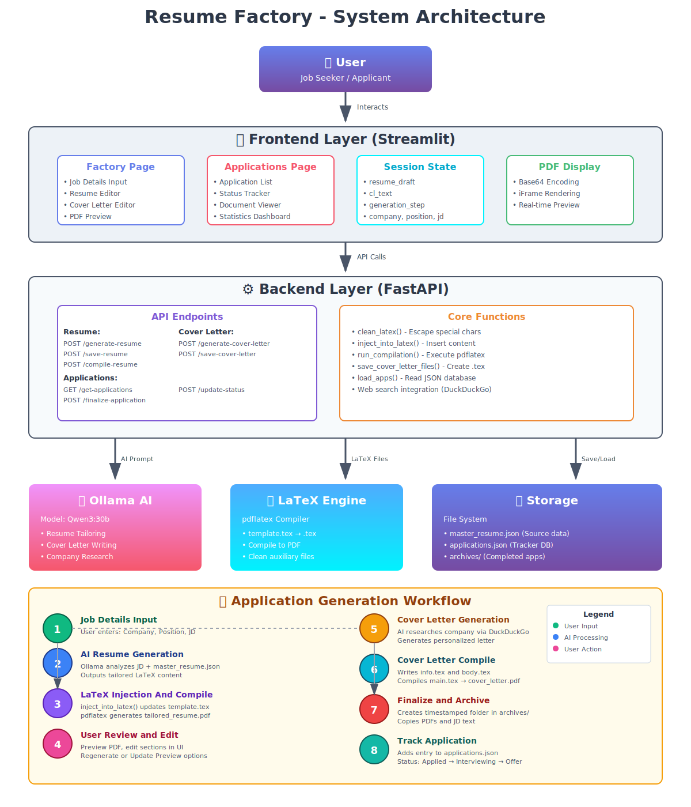

# 🏗️ Resume Factory

An intelligent resume and cover letter generation system powered by AI. Build tailored applications for each job posting with automated LaTeX compilation and comprehensive application tracking.


## ✨ Features

- **🤖 AI-Powered Generation**: Uses Ollama (Qwen3:30b) to intelligently tailor resumes and cover letters to job descriptions
- **📝 Live Editing**: Real-time preview and editing of generated documents with side-by-side PDF preview
- **🔄 Regeneration**: Regenerate any section or document if you're not satisfied with the output
- **📊 Application Tracker**: Track all your applications with status updates (Applied, Interviewing, Offer, Rejected, Ghosted)
- **🎨 LaTeX Compilation**: Professional PDF generation using LaTeX templates
- **💾 Archiving**: Automatically archive all application materials (resume, cover letter, job description)
- **🔍 Company Research**: Integrates web search to research companies for personalized cover letters
- **📱 Modern UI**: Clean, intuitive interface built with Streamlit

## 🎯 Use Cases

- Job seekers applying to multiple positions
- Career coaches helping clients
- Recruiters managing candidate applications
- Anyone who wants to maintain consistent, professional application materials

## 🏗️ Architecture



The system consists of three main components:

1. **Frontend** (Streamlit): User interface for creating and managing applications
2. **Backend** (FastAPI): API endpoints for resume/cover letter generation and compilation
3. **AI Engine** (Ollama): Local LLM for intelligent content generation

See the [Architecture Diagram](#architecture-diagram) below for detailed workflow.

## 📋 Prerequisites

- Python 3.8+
- LaTeX distribution (TeX Live, MiKTeX, or MacTeX)
- Ollama with Qwen3:30b model installed
- Git

### Installing LaTeX

**Ubuntu/Debian:**
```bash
sudo apt-get install texlive-latex-base texlive-latex-extra
```

**macOS:**
```bash
brew install --cask mactex
```

**Windows:**
Download and install [MiKTeX](https://miktex.org/download)

### Installing Ollama

Visit [Ollama's official website](https://ollama.ai) and follow installation instructions for your OS.

Then pull the required model:
```bash
ollama pull qwen3:30b
```

## 🚀 Installation

1. **Clone the repository**
```bash
git clone https://github.com/yourusername/resume-factory.git
cd resume-factory
```

2. **Create virtual environment**
```bash
python -m venv venv
source venv/bin/activate  # On Windows: venv\Scripts\activate
```

3. **Install dependencies**
```bash
pip install -r requirements.txt
```

4. **Verify LaTeX installation**
```bash
pdflatex --version
```

## 📁 Project Structure

```
resume-factory/
│
├── frontend.py              # Streamlit UI
├── backend.py               # FastAPI server
├── template.tex             # Resume LaTeX template
├── resume.cls               # LaTeX class file
├── main.tex                 # Cover letter template
├── master_resume.json       # Your master resume data
│
├── archives/                # Archived applications
│   └── YYYY-MM-DD_Position_Company/
│       ├── *_Resume.pdf
│       ├── *_coverletter.pdf
│       └── *_JD.txt
│
├── applications.json        # Application tracking database
├── tailored_resume.tex      # Generated resume (working file)
├── tailored_resume.pdf      # Compiled resume PDF
├── info.tex                 # Cover letter info (working file)
├── body.tex                 # Cover letter body (working file)
└── cover_letter.pdf         # Compiled cover letter PDF
```

## 🎮 Usage

### 1. Configure Your Master Resume

Edit `master_resume.json` with your information:

```json
{
  "name": "Your Name",
  "contact": {
    "email": "your.email@example.com",
    "phone": "(123) 456-7890",
    "location": "City, State",
    "linkedin": "linkedin.com/in/yourprofile",
    "github": "github.com/yourusername"
  },
  "summary": "Your professional summary...",
  "skills": {
    "Category 1": ["skill1", "skill2"],
    "Category 2": ["skill3", "skill4"]
  },
  "experience": [...],
  "projects": [...],
  "certifications": [...],
  "education": [...]
}
```

### 2. Start the Backend Server

```bash
uvicorn backend:app --reload --port 8000
```

The API will be available at `http://localhost:8000`

### 3. Launch the Frontend

In a new terminal:

```bash
streamlit run frontend.py
```

The UI will open in your browser at `http://localhost:8501`

### 4. Create an Application

1. **Enter Job Details**: Company name, position title, and full job description
2. **Generate Resume**: AI tailors your master resume to the job description
3. **Review & Edit**: Edit any section and update the PDF preview
4. **Generate Cover Letter**: AI creates a personalized cover letter with company research
5. **Review & Edit**: Make final adjustments to the cover letter
6. **Archive**: Save the complete application to your tracker

### 5. Track Applications

Navigate to the "Applications" page to:
- View all archived applications
- Update application status
- Review job descriptions and submitted materials
- Track your job search progress

## 🔧 Configuration

### Customize LaTeX Templates

Edit `template.tex` to modify resume layout, fonts, or styling. The system uses the custom `resume.cls` class file.

### Change AI Model

In `backend.py`, modify the model:

```python
llm = ChatOllama(model="qwen3:30b", temperature=0.1)  # Change model here
```

### Adjust Generation Parameters

Modify prompts in `backend.py` functions:
- `generate()` - Resume generation prompt
- `generate_cl()` - Cover letter generation prompt

## 📊 Architecture Diagram

See the detailed system architecture and workflow in the separate architecture diagram artifact.

## 🛠️ API Endpoints

### Resume Endpoints

- `POST /generate-resume` - Generate tailored resume from job description
- `POST /save-resume` - Save edited resume content
- `POST /compile-resume` - Compile LaTeX to PDF

### Cover Letter Endpoints

- `POST /generate-cover-letter` - Generate personalized cover letter
- `POST /save-cover-letter` - Save edited cover letter
- Automatically compiles on save

### Application Management

- `GET /get-applications` - Retrieve all archived applications
- `POST /finalize-application` - Archive complete application package
- `POST /update-status` - Update application status

## 🤝 Contributing

Contributions are welcome! Please feel free to submit a Pull Request.

1. Fork the repository
2. Create your feature branch (`git checkout -b feature/AmazingFeature`)
3. Commit your changes (`git commit -m 'Add some AmazingFeature'`)
4. Push to the branch (`git push origin feature/AmazingFeature`)
5. Open a Pull Request

## 🐛 Troubleshooting

### PDF Not Generating

- Verify LaTeX is installed: `pdflatex --version`
- Check backend terminal for compilation errors
- Review `.log` files for LaTeX errors

### AI Generation Fails

- Ensure Ollama is running: `ollama list`
- Verify model is downloaded: `ollama pull qwen3:30b`
- Check backend terminal for error messages

### Web Search Not Working

- DuckDuckGo search may be rate-limited
- Check internet connection
- Fallback text will be used automatically

## 📝 License

This project is licensed under the MIT License - see the LICENSE file for details.

## 🙏 Acknowledgments

- LaTeX resume template based on [Medium Length Professional CV](http://www.LaTeXTemplates.com)
- AI powered by [Ollama](https://ollama.ai)
- UI framework: [Streamlit](https://streamlit.io)
- Backend framework: [FastAPI](https://fastapi.tiangolo.com)

## 📧 Contact

Your Name - atrijoshi12@gmail.com

Project Link: [https://github.com/akjoshi12/resume-factory](https://github.com/akjoshi12/resume-factory/)

---

**Note**: Remember to update your `master_resume.json` regularly with new experiences, skills, and projects to keep your applications current and relevant.
